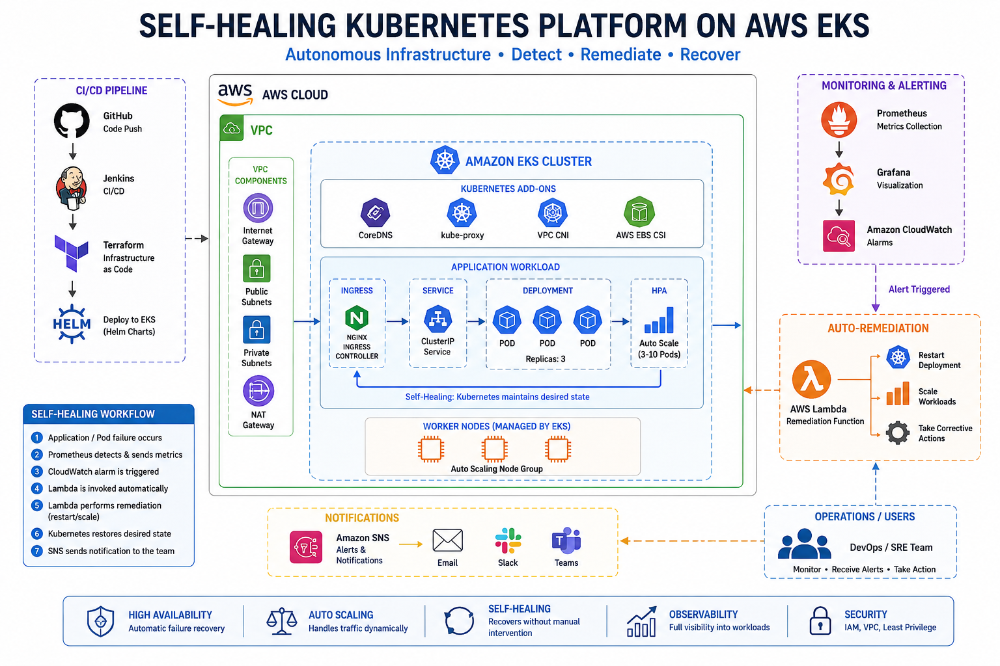

## Self-Healing Kubernetes Platform on AWS EKS

### Overview

This project demonstrates a production-grade self-healing Kubernetes infrastructure platform on AWS.

The platform automatically:

- detects failures
- replaces unhealthy pods
- scales workloads automatically
- triggers remediation workflows
- notifies operators
  

 
 
 ### Architecture


### Core Features
 
 - Kubernetes Self-Healing
 - Kubernetes automatically maintains desired state.
 - Auto-Scaling
 - Horizontal Pod Autoscaler scales workloads dynamically.


### Monitoring & Alerting

Prometheus monitors workloads continuously.


### Autonomous Remediation

Lambda triggers automated recovery workflows.


### Infrastructure Components
- Amazon EKS
- Terraform
- Jenkins
- Prometheus
- Grafana
- Lambda
- CloudWatch
- SNS
- Kubernetes HPA


### Failure Simulation

Trigger failure:

```
kubectl delete pod POD_NAME
```

Observe:

- Kubernetes recreate pod
- Prometheus alert
- Lambda remediation
- SNS notification


### Why This Project Matters

This project demonstrates:

- autonomous operations
- production resilience
- cloud-native reliability
- Kubernetes recovery engineering

The project demonstrate how platform engineering and SRE teams operate production systems.
